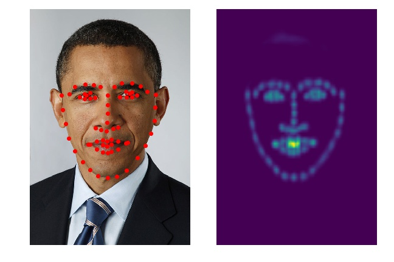

# OpenPose Face Landmarks for PyTorch

A pytorch implementation of the face landmarking tool from OpenPose.

<https://github.com/CMU-Perceptual-Computing-Lab/openpose>

Please observe the licensing terms of the original authors, which does not permit
commercial use.

## Installation

    cd torchface
    pip install -e .

## Usage

    from face.pose import Face
    facedetector = Face()
    img = Image.open("face.jpg")
    lmk = facedetector.detect(img)

It is possible to expose the heatmaps with:

    heatmaps = facedetector._detect(img)
